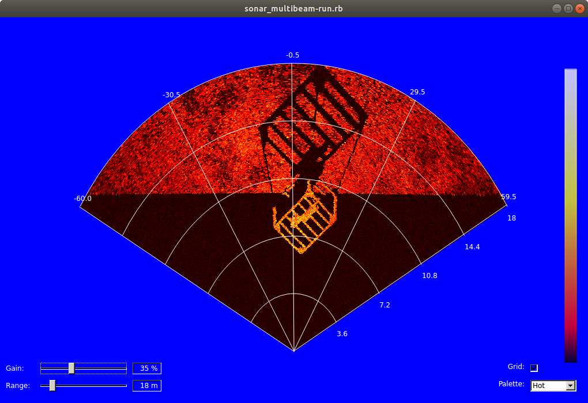
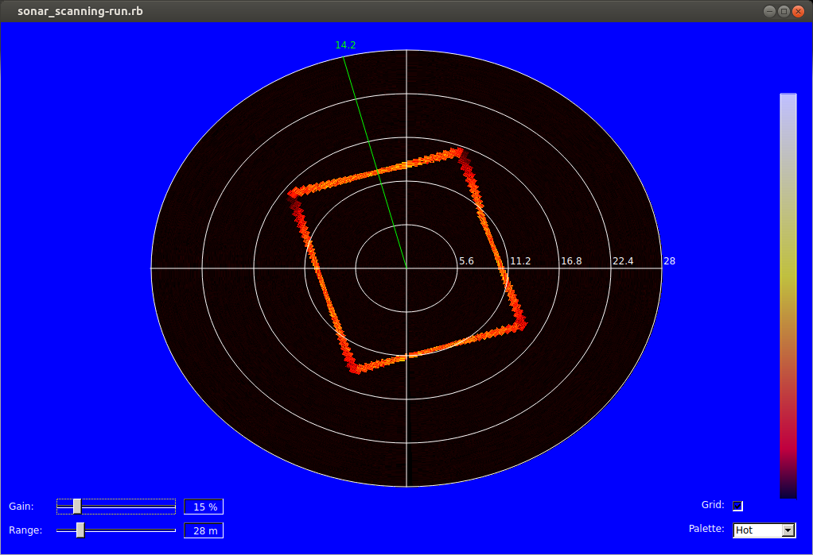

Imaging sonar simulator
==========================

This repository presents the imaging sonar simulator + partly data as presented in the following publications:

- **[A rasterized ray-tracer pipeline for real-time, multi-device sonar simulation](http://www.sciencedirect.com/science/article/abs/pii/S1524070320300278)** <br>
R. Cerqueira, T. Trocoli, J. Albiez and L. Oliveira<br>
Elsevier Graphical Models Journal. 2020.<br>

- **[A multi-device sonar simulator for real-time underwater applications](http://ivisionlab.ufba.br/doc/thesis/2019/PhD_Thesis_romulo_final.pdf)** <br>
R. Cerqueira<br>
PhD thesis. Federal University of Bahia. 2019. <br>

- **[A novel GPU-based sonar simulator for real-time applications](http://www.sciencedirect.com/science/article/pii/S0097849317301371)** <br>
R. Cerqueira, T. Trocoli, G. Neves, S. Joyeux, J. Albiez and L. Oliveira <br>
Elsevier Computers & Graphics Journal<br>
Special Section on SIBGRAPI 2017 <br>

- **[Custom Shader and 3D Rendering for computationally efficient Sonar Simulation](http://sibgrapi.sid.inpe.br/col/sid.inpe.br/sibgrapi/2016/08.09.11.51/doc/sibgrapi16.pdf)** <br>
R. Cerqueira, T. Trocoli, G. Neves, L. Oliveira, S. Joyeux and J. Albiez <br>
SIBGRAPI 2016 <br>

Types of simulated sonar devices:
- Mechanical scanning imaging sonar (MSIS)
- Forward-looking sonar (FLS)

Packages
==========================
The imaging sonar simulation is split into five main packages, as follows:
* [**simulation/normal_depth_map**](http://github.com/romulogcerqueira/simulation-normal_depth_map): samples each OSG frame and computes the sonar rendering parameters during rasterization pipeline on GPU: echo intensity and pulse distance;
* [**simulation/gpu_sonar_simulation**](http://github.com/romulogcerqueira/simulation-gpu_sonar_simulation): decodes the sonar rendering parameters into simulated sonar data;
* [**simulation/orogen/imaging_sonar_simulation**](http://github.com/romulogcerqueira/simulation-orogen-imaging_sonar_simulation): simulates the operation of MSIS and FLS sensors; controls the virtual sonar device in the underwater scene; handles sonar properties; and provides I/O ports to interact with other Rock components.
* [**simulation/uwmodels**](http://github.com/romulogcerqueira/simulation-uwmodels): contains the underwater scenarios and 3D models;
* [**simulation/examples**](https://github.com/romulogcerqueira/simulation-examples): contains scripts to run the imaging sonar simulations.

How to install
==========================

The following steps are tested correctly on

| OS                 | OpenCV            | Ruby          | Test  | Last test       |
|--------------------|-------------------|---------------|-------|-----------------|
| `Ubuntu 18.04 LTS` | `OpenCV 3.2.x`    | `Ruby 2.5.1`  | `OK`  | `25 Feb 2022`   |
| `Ubuntu 16.04 LTS` | `OpenCV 2.4.x`    | `Ruby 2.3.1`  | `OK`  | `18 Feb 2020`   |

```sh
$ sudo apt-get install ruby ruby-dev
$ mkdir sonar_simulation
$ cd sonar_simulation
$ wget http://raw.githubusercontent.com/romulogcerqueira/sonar_simulation-buildconf/master/bootstrap.sh
$ sh bootstrap.sh
```

Using docker for this repository (optional)
==========================
Optionally, you may choose to build this repository using Docker, for convenience. Follow the instructions [here](https://github.com/romulogcerqueira/docker-sonar_simulation). 

How to run the examples
==========================
Checkout and build the packages:
```sh
$ aup
$ amake
```
Go to examples directory:

```sh
$ acd simulation/examples/
```

To simulate the FLS device operation:
```sh
$ ruby sonar_multibeam-run.rb
```


To simulate the MSIS device operation:
```sh
$ ruby sonar_scanning-run.rb
```


Citation
==========================
Please consider citing our publications if you find this code useful for your research:
```
@article{CERQUEIRA2020,
    title = {A rasterized ray-tracer pipeline for real-time, multi-device sonar simulation},
    author = {Cerqueira, R{\^o}mulo and Trocoli, Tiago and Albiez, Jan and Oliveira, Luciano},
    journal = {Graphical Models},
    volume = {111},
    year = {2020},
    issn = {1524-0703},
    doi = {http://doi.org/10.1016/j.gmod.2020.101086},
    url = {http://www.sciencedirect.com/science/article/pii/S1524070320300278}
}
```

```
@phdthesis{CERQUEIRA2019,
    title = {A multi-device sonar simulator for real-time underwater applications},
    author = {Cerqueira, R{\^o}mulo},
    year = {2019},
    school = {Federal University of Bahia}
}
```

```
@article{CERQUEIRA2017,
    title = {A novel GPU-based sonar simulator for real-time applications},
    author = {Cerqueira, R{\^o}mulo and Trocoli, Tiago and Neves, Gustavo and Joyeux, Sylvain and Albiez, Jan and Oliveira, Luciano},
    journal = {Computers & Graphics},
    volume = {68},
    number = {Supplement C},
    pages = {66--76},
    year = {2017},
    issn = {0097-8493},
    doi = {http://dx.doi.org/10.1016/j.cag.2017.08.008},
    url = {http://www.sciencedirect.com/science/article/pii/S0097849317301371}
}
```
```
@inproceedings{CERQUEIRA2016,
    title = {Custom Shader and 3D Rendering for computationally efficient Sonar Simulation},
    author = {Cerqueira, R{\^o}mulo and Trocoli, Tiago and Neves, Gustavo and Oliveira, Luciano and Joyeux, Sylvain and Albiez, Jan},
    booktitle = {XIX Conference on Graphics, Patterns and Images (SIBGRAPI)},
    booksubtitle = {Workshop on Working In Progress (WIP)},
    year = {2016},
    pages = {1--6}
}
```

Known issues / Suggested improvements
==========================
- https://github.com/romulogcerqueira/simulation-normal_depth_map/issues/18
- https://github.com/romulogcerqueira/simulation-normal_depth_map/issues/19
- https://github.com/romulogcerqueira/simulation-normal_depth_map/issues/20
